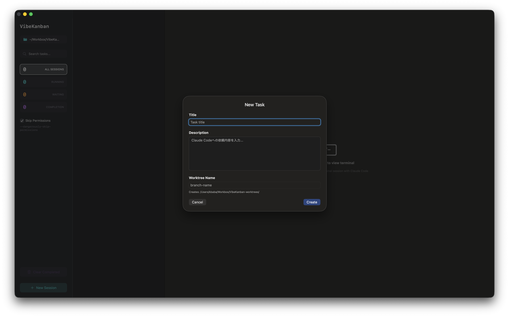
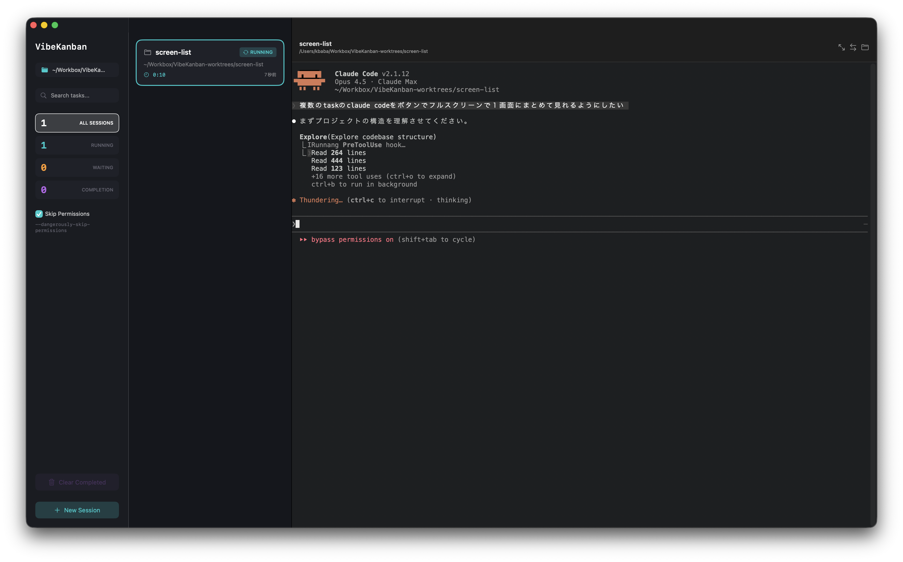
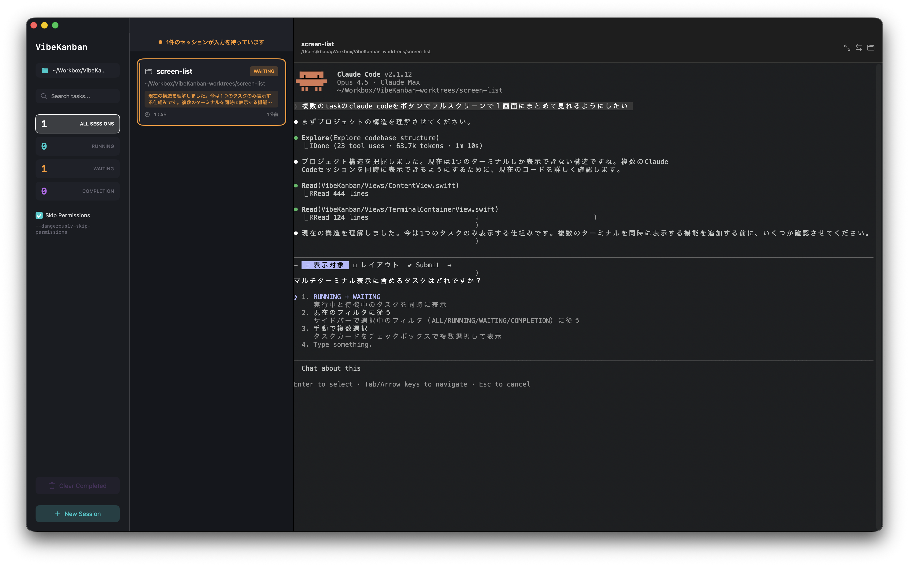
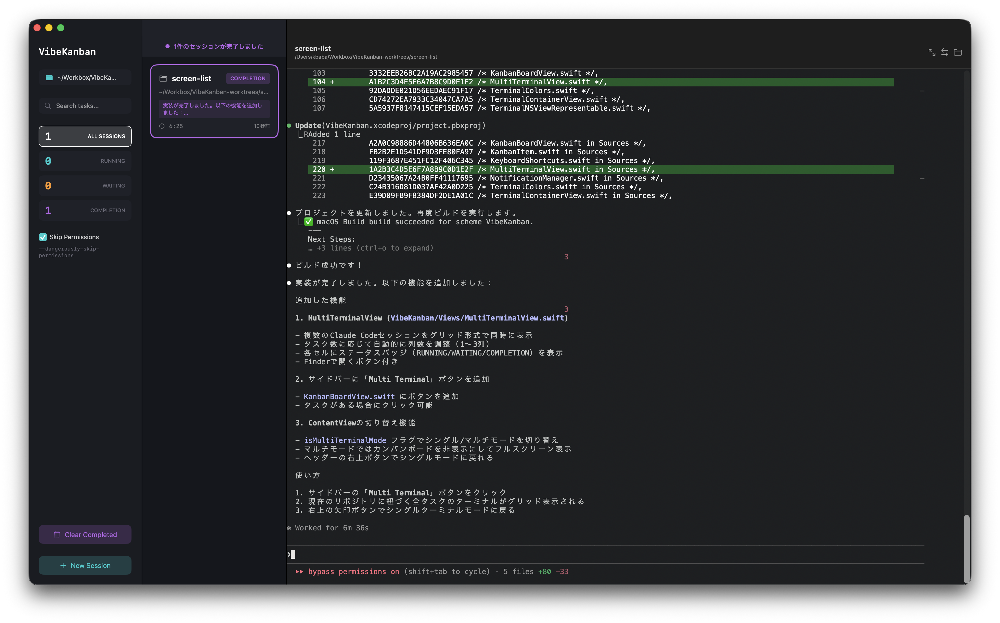
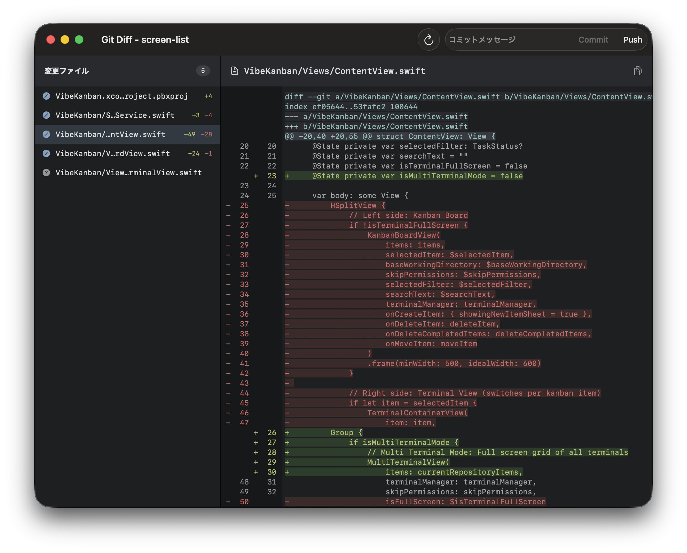

# VibeKanban

macOS向けのカンバンスタイルタスク管理アプリ。各タスクにターミナルセッションを関連付け、Claude Codeを実行できます。

## スクリーンショット

### タスク作成


### RUNNING - Claude Code実行中


### WAITING - 入力待ち


### COMPLETION - タスク完了


### Git Diff / Commit / Push


## なぜVibeKanban？

### 1. 複数タスクの並列管理
複数のClaude Codeセッションを同時に実行・監視できます。タスクごとに独立したGit worktreeで作業が分離されるため、一つのタスクがWAITING中に他のタスクを進められます。

### 2. ステータスの可視化
RUNNING/WAITING/COMPLETIONが一目でわかり、通知機能でバックグラウンドでも状況を把握できます。入力待ちのタスクを見逃しません。

### 3. コンテキストスイッチの効率化
タスク切り替えがワンクリック。各タスクの最新レスポンスがカードに表示されるため、「今何をしていたか」を思い出しやすくなります。

### 4. Git Worktree統合
タスク作成時に自動でブランチとworktreeを作成し、タスク削除時に自動でクリーンアップ。作業の衝突を防止します。

### 5. 作業時間の可視化
タスクごとの作業時間を自動計測。どのタスクにどれだけ時間をかけたかがわかります。

### こんな人におすすめ
- 複数の機能開発やバグ修正を並行して進めたい人
- Claude Codeを「監視」しながら他の作業をしたい人
- AIペアプログラミングのワークフローを効率化したい人

## 特徴

- **カンバンボード**: タスクをRUNNING / WAITING / IDLE / COMPLETIONのステータスで管理
- **ターミナル統合**: 各タスクに専用のターミナルセッション（SwiftTerm）
- **Claude Code連携**: タスク作成時に自動でClaude Codeを起動
- **Git Worktree対応**: タスクごとにGit worktreeを自動作成
- **Git Diff表示**: Tower風のリッチなdiff表示（行番号、色分け、コピー可能）
- **Git Commit/Push**: Diff画面から直接コミット・プッシュ可能
- **ステータス自動検出**: Claude Codeの状態をhooksで自動検出
- **通知機能**: WAITING/COMPLETION時にmacOS通知を送信
- **作業時間計測**: タスクごとの作業時間を自動計測
- **画像ドラッグ&ドロップ**: ターミナルに画像をドロップしてパスを入力
- **キーボードショートカット**: 効率的な操作のためのショートカットキー
- **リポジトリ別タスク表示**: 選択したリポジトリに紐づくタスクのみ表示
- **完了タスク一括削除**: COMPLETIONタスクをまとめて削除
- **最新レスポンス表示**: タスクカードにClaude Codeの最新応答を表示

## 必要要件

- macOS 14.0以降
- Xcode 26.0以降
- [Claude Code](https://claude.ai/download) (CLI)

## インストール

### 1. リポジトリをクローン

```bash
git clone https://github.com/your-username/VibeKanban.git
cd VibeKanban
```

### 2. ビルド

```bash
xcodebuild -scheme VibeKanban -configuration Release build
```

または Xcode で `VibeKanban.xcodeproj` を開いてビルド。

## 使い方

### 基本的な流れ

1. **リポジトリを選択**: サイドバーの「Set Repository」でGitリポジトリを選択
2. **タスクを作成**: 「New Session」ボタンでタスクを作成
   - タイトルと説明を入力
   - 自動でGit worktreeとブランチが作成される
3. **作業開始**: タスクをクリックするとターミナルが表示され、Claude Codeが起動
4. **ステータス確認**: Claude Codeの状態に応じてタスクのステータスが自動更新

### ステータス

| ステータス | 説明 |
|-----------|------|
| RUNNING | Claude Codeが処理中 |
| WAITING | ユーザーの入力待ち |
| IDLE | アイドル状態 |
| COMPLETION | タスク完了 |

### Git Diff

ターミナルヘッダーの矢印ボタンをクリックすると、Git Diffウィンドウが開きます。

- ファイル一覧から変更ファイルを選択
- 行番号付きのdiff表示
- テキスト選択・コピー可能

### Git Commit/Push

Git Diffウィンドウのツールバーから直接コミット・プッシュできます。

- コミットメッセージを入力してCommitボタンをクリック
- Pushボタンでリモートにプッシュ（upstreamが未設定の場合は自動設定）

### Skip Permissions

サイドバーの「Skip Permissions」をオンにすると、Claude Codeを`--dangerously-skip-permissions`フラグ付きで起動します。

### 画像のドラッグ&ドロップ

ターミナル領域に画像ファイルをドラッグ&ドロップすると、ファイルパスが自動入力されます。Claude Codeに画像を見せる際に便利です。

対応形式: PNG, JPG, JPEG, GIF, WebP, BMP, TIFF, HEIC, HEIF

### 完了タスクの一括削除

サイドバーの「Clear Completed」ボタンをクリックすると、現在のリポジトリに紐づくCOMPLETIONステータスのタスクをまとめて削除できます。Git worktreeとブランチも同時に削除されます。

### キーボードショートカット

| ショートカット | 機能 |
|---------------|------|
| ⌘N | 新規タスク作成 |
| ⌘↑ | 前のタスクを選択 |
| ⌘↓ | 次のタスクを選択 |
| ⌘0 | 全セッション表示（フィルタ解除） |
| ⌘1 | RUNNINGでフィルタ |
| ⌘2 | WAITINGでフィルタ |
| ⌘3 | COMPLETIONでフィルタ |
| ⌘R | リフレッシュ |

## 技術スタック

- **UI**: SwiftUI
- **データ永続化**: SwiftData
- **ターミナル**: [SwiftTerm](https://github.com/migueldeicaza/SwiftTerm)

## アーキテクチャ

```
VibeKanban/
├── Models/
│   └── KanbanItem.swift              # SwiftDataモデル
├── Views/
│   ├── ContentView.swift             # メインビュー
│   ├── KanbanBoardView.swift         # カンバンボード
│   ├── TerminalContainerView.swift   # ターミナルコンテナ
│   ├── TerminalSession.swift         # ターミナルセッション管理
│   ├── TerminalSessionManager.swift  # セッション管理
│   ├── TerminalNSViewRepresentable.swift # ターミナルビュー（D&D対応）
│   └── GitDiffView.swift             # Git Diff表示
├── Services/
│   ├── GitService.swift              # Git操作
│   └── NotificationManager.swift     # 通知管理
├── Helpers/
│   ├── ClaudeHooksManager.swift      # Claude Code hooks設定
│   ├── KeyboardShortcuts.swift       # キーボードショートカット
│   └── WindowManager.swift           # ウィンドウ管理
└── VibeKanbanApp.swift               # アプリエントリーポイント
```

## Claude Code Hooks

VibeKanbanはClaude Codeのhooks機能を使用してステータスを自動検出します。

タスク作成時に以下のhooksが自動設定されます：

- **PreToolUse**: ツール実行前に`running`ステータスを設定
- **Notification**: 通知時に`waiting`ステータスを設定
- **Stop**: 停止時に`completion`ステータスを設定

## ライセンス

MIT License

## 作者

Created with Claude Code
